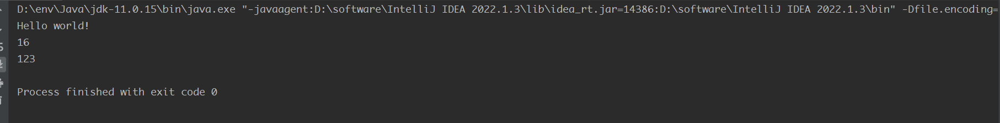
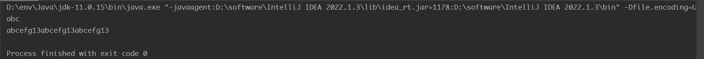
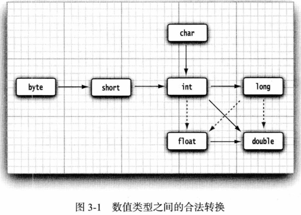
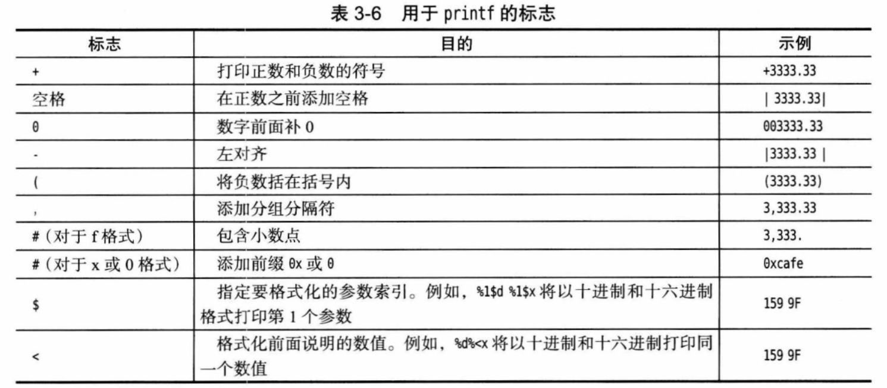

## 基础语法

常见变量不赘述了，记下一些自己不太清楚的知识点

Java10之后，对于局部变量，若考研推断出变量类型，可以使用Var来定义变量

```java
package part1;

public class parc1 {
    public static void main(String []args)
    {
        System.out.println("Hello world!");
        System.out.println(Character.SIZE);
        var $a=123;
        System.out.println($a);
    }
}
```



常量修饰符：final(不同于C/C++)，可以在类中使用关键则static final修饰常量供其他函数使用

### 字符串操作

#### 区子串

```java
String str = "abcefg";
System.out.println(str.substring(0, 3));
```

#### 字符串拼接

> 拼接字符串+数字存在隐式转换

```java
String s = str+13;
System.out.println(s.repeat(3));
```



> 在Java中字符串不可变，无法修改字符串的单个字符
>
> 在Java中使用equals判断两字符串是否相同，不能用==判断

#### 常用API（用到再补）

| API名称               | 作用               |
| --------------------- | ------------------ |
| int charAt(int index) | 返回给定位置的字符 |

#### 构建字符串

> 有些时候，需要由较短的字符串构建字符串,例如，按键或来自文件中的单词。如果采用字符串拼接的方式来达到这个目的，效率会比较低。每次拼接字符串时，都会构建一个新的`String`对象，既耗时，又浪费空间。使用`StringBuilder`类就可以避免这个问题的发生。

```java
StringBuilder builder = new StringBuilder();
builder.append(str);
builder.append(s);
System.out.println(builder.toString());
```

##### 一些API(日后补)

### 数据类型的合法转换



> 图片来自Java核心技术卷1

### 输入和输出

#### 输入

> 使用Scanner对象实现

```java
Scanner in = new Scanner(System.in);
System.out.println("Please input yout name:");
String name = in.nextLine();
System.out.println(name);
```


| API                 | 作用                       |
| ------------------- | -------------------------- |
| String nextLine()   | 读取下一行内容             |
| String next()       | 读取下一个单词             |
| int nextInt()       | 读取下一个表示整数的序列   |
| double nextDouble() | 读取下一个表示浮点数的序列 |

#### 输出

```java
System.out.println(xxxxxxx);
System.out.printf("Your name is %s",name);
```

> 和C语言很像，使用printf函数即可



## 对象和类

